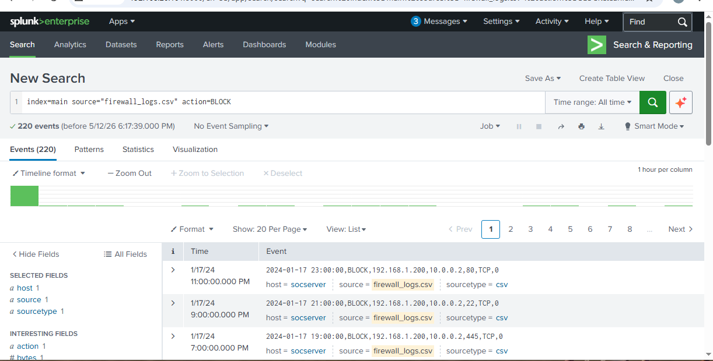
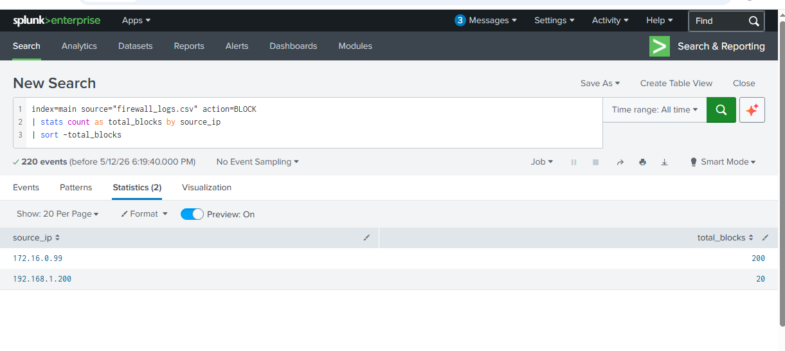
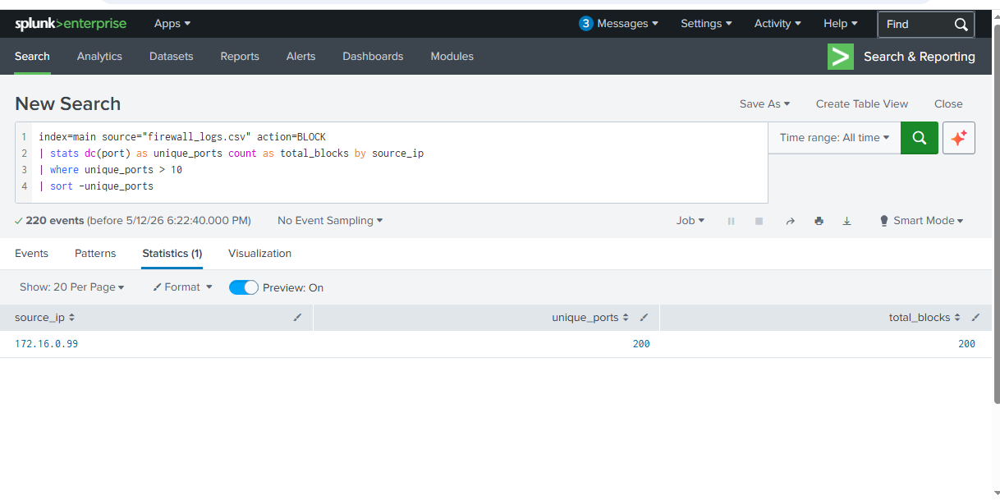
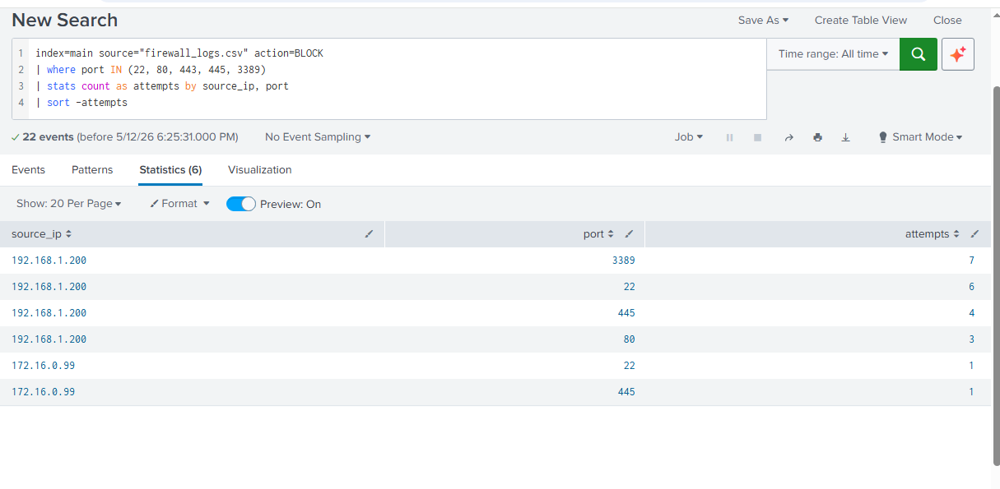
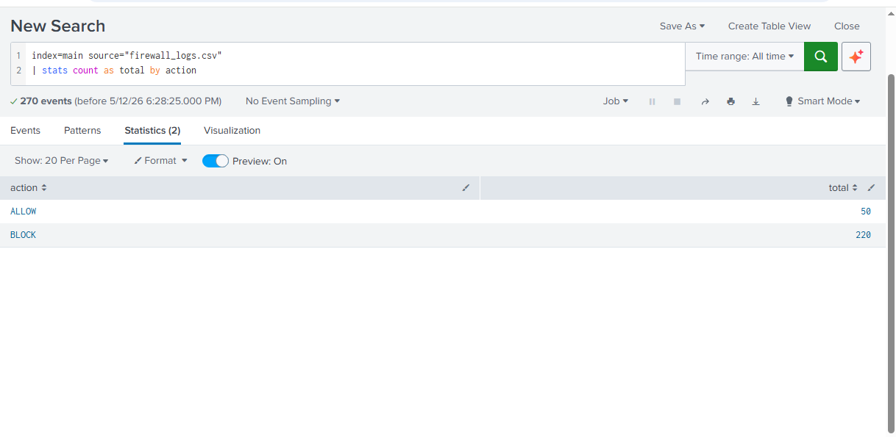

# 🔥 Firewall Log Analysis Using Splunk
## Detecting Port Scanning and Suspicious Network Activity

---

## 📌 Problem
Firewalls generate thousands of logs per hour.
Without proper analysis, malicious activity can 
hide inside normal traffic. This project analyzes 
simulated firewall logs to detect port scanning 
and targeted attack behaviour using Splunk SIEM.

---

## 🎯 Objectives
- Simulate realistic firewall logs in Python
- Ingest logs into Splunk for analysis
- Write SPL queries to detect port scanning
- Identify targeted attacks on sensitive ports
- Compare allowed vs blocked traffic ratios

---

## 🛠️ Tools Used
| Tool | Purpose |
|---|---|
| **Splunk** | SIEM platform for log analysis |
| **Python** | Firewall log simulation |
| **SPL** | Splunk search language |
| **Firewall Logs** | Network security event data |

---

## 🗃️ Dataset
Simulated firewall logs with 270 records:

| Category | Count | Description |
|---|---|---|
| Normal Traffic | 50 | Legitimate ALLOW events |
| Port Scan Blocks | 200 | Scanner IP blocked on 200 ports |
| Suspicious IP Blocks | 20 | Targeted attacks on sensitive ports |

**Log Fields:**
- `timestamp` — When the event occurred
- `action` — ALLOW or BLOCK
- `source_ip` — Origin of traffic
- `destination_ip` — Target of traffic
- `port` — Destination port
- `protocol` — TCP or UDP
- `bytes` — Data transferred

---

## 🔎 Detection Queries (SPL)

### Query 1 — All Blocked Traffic
index=main source="firewall_logs.csv" action=BLOCK

Retrieves all blocked events. This is the starting point for firewall log investigation.

### Query 2 — Count Blocks by Source IP
index=main source="firewall_logs.csv" action=BLOCK
| stats count as total_blocks by source_ip
| sort -total_blocks

Groups blocked traffic by IP to identify the
highest offenders.

### Query 3 — Detect Port Scanning
index=main source="firewall_logs.csv" action=BLOCK
| stats dc(port) as unique_ports,
count as total_blocks
by source_ip
| where unique_ports > 10
| sort -unique_ports

Uses distinct count to find IPs targeting many
different ports, this is the key indicator of port scanning.

### Query 4 — Sensitive Port Attack Detection
index=main source="firewall_logs.csv" action=BLOCK
| where port IN (22, 80, 443, 445, 3389)
| stats count as attempts by source_ip, port
| sort -attempts

Flags blocked attempts on high value ports
commonly targeted by attackers.

### Query 5 — Allowed vs Blocked Comparison
index=main source="firewall_logs.csv"
| stats count as total by action

Compares legitimate vs blocked traffic to
identify unusual ratios indicating attack activity.

---

## 📸 Results

### Query 1 — All Blocked Traffic

### Query 2 — Blocks by Source IP

### Query 3 — Port Scan Detected

### Query 4 — Sensitive Port Attacks

### Query 5 — Allow vs Block Comparison

---

## 🧠 Analysis

### Finding 1 — Port Scanner Identified
IP 172.16.0.99 was blocked on 200 unique ports
in under 7 minutes. This systematic scanning
pattern is consistent with automated port
scanning tools like Nmap.

### Finding 2 — Targeted Attack Behaviour
IP 192.168.1.200 specifically targeted sensitive
ports with repeated attempts:

| Port | Service | Attempts | Risk |
|---|---|---|---|
| 3389 | RDP | 7 | Critical — remote control |
| 22 | SSH | 6 | Critical — remote access |
| 445 | SMB | 4 | High — ransomware target |
| 80 | HTTP | 3 | Medium — web admin panel |

This is not random scanning, it is a deliberate
targeting of remote access services.

### Finding 3 — High Block Ratio
81% of all traffic was blocked by the firewall:

| Action | Count | Percentage |
|---|---|---|
| BLOCK | 220 | 81% |
| ALLOW | 50 | 19% |

This extreme ratio indicates sustained attack
activity against the network.

### Finding 4 — Firewall Effectiveness
The firewall successfully blocked all malicious
traffic. However the volume and persistence of
attacks requires immediate investigation and
response beyond firewall blocking alone.

---

## 🔑 Sensitive Ports Reference

| Port | Service | Why Attackers Target It |
|---|---|---|
| 22 | SSH | Remote command execution |
| 80 | HTTP | Web admin panel access |
| 443 | HTTPS | Encrypted web traffic |
| 445 | SMB | Ransomware propagation |
| 3389 | RDP | Remote desktop takeover |

---

## ✅ Conclusion & Recommendations

### Immediate Actions
| Priority | Action |
|---|---|
| 1 | 🚫 Block 172.16.0.99 and 192.168.1.200 permanently |
| 2 | 🔍 Investigate what 192.168.1.200 was targeting |
| 3 | 🔒 Disable RDP and SSH external access if not needed |
| 4 | 📢 Escalate to Tier 2 for deeper investigation |

### Preventive Recommendations
| Recommendation | Purpose |
|---|---|
| Implement IDS/IPS | Detect and block scans automatically |
| Enable geo-blocking | Block traffic from suspicious regions |
| Set up real-time Splunk alerts | Immediate notification of scan activity |
| Restrict sensitive ports | Only allow trusted IPs on ports 22, 3389 |
| Regular firewall rule audit | Remove unnecessary open ports |

---

## 🔗 Related Projects
- [Brute Force Detection](https://github.com/Phredreeq/brute-force-detection)
- [Password Spray Detection](https://github.com/Phredreeq/password-spray-detection)
- [Network Traffic Analysis](https://github.com/Phredreeq/network-traffic-analysis-wireshark)
- [Incident Investigation Report](https://github.com/Phredreeq/incident-investigation-report)

---

## 👤 Author
Fredrick Agufenwa

Cybersecurity Student | SOC & Threat Detection
